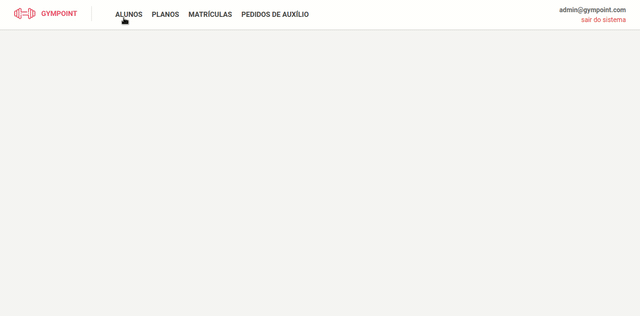

<h1 align="center">

</h1>

### :page_with_curl: About
This project is a real application for managing a gym.

#### To start, [**Docker**](https://www.docker.com/) is required

### :rocket: How to install and start 
- `git clone https://github.com/jonabf1/GymPoint`
- **Go to repository folder**
- `docker-compose up` (in Backend)
- `yarn && yarn start` (in Frontend)

#### If you want to see the routes in backend, go to **src/routes**

### :white_check_mark: Result in Backend

      
      

### :white_check_mark: Result in Frontend

  

---

Made with ♥ by <a href="https://www.linkedin.com/in/jonathan-barros-franco">Jonathan</a>

